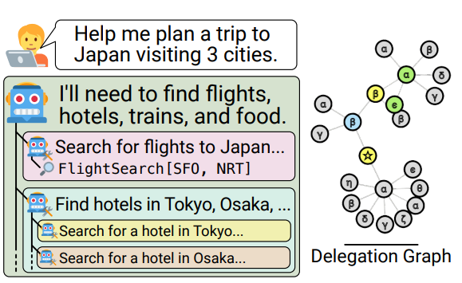

# ReDel: A Toolkit for LLM-Powered Recursive Multi-Agent Systems ([English](#english-version) | [Chinese](#中文版))

source: [paper](https://arxiv.org/abs/2408.02248) | [github](https://github.com/zhudotexe/redel)

# English Version

## ReDel: A Toolkit for LLM-Powered Recursive Multi-Agent Systems

### Problem

The paper introduces **ReDel**, a toolkit designed for recursive multi-agent systems powered by Large Language Models (LLMs). The primary issue addressed is the absence of effective tools and libraries for recursive multi-agent systems, where agents autonomously decide when and how to delegate tasks to sub-agents dynamically.

#### Key Limitations in Existing Frameworks

1. **Static Delegation**:  
   Existing frameworks (e.g., LangGraph, LlamaIndex, AutoGPT) only support single-layer delegation or static problem decomposition, unsuitable for recursive delegation.

2. **Tooling for Analysis**:  
   Most frameworks lack comprehensive logging, event-based instrumentation, or replay tools for effective debugging and evaluation.

3. **Limited Academic Accessibility**:  
   Many frameworks are proprietary or locked behind paywalls, limiting their use in academic research.

---

### Solution

**ReDel** provides a modular, open-source framework for recursive multi-agent systems. It enables LLM-powered agents to dynamically decompose tasks, delegate subtasks to sub-agents, and employ custom tools and delegation schemes.

#### Key Features

1. **Custom Tool Creation**:  
   Developers can define Python-based tools for agents to interact with the environment (e.g., web browsing, API calls).

2. **Dynamic Delegation Schemes**:  
   Offers built-in schemes (e.g., DelegateOne for synchronous and DelegateWait for asynchronous delegation) with support for custom schemes.

3. **Event-Driven Architecture**:  
   Comprehensive logging of all system events for debugging and data analysis.

4. **Interactive Web Interface**:  
   Real-time interaction and visualization of task decomposition graphs, plus replay tools for analyzing past runs.

#### Research-Oriented Design

- **Free and Open Source** (MIT License): Encourages reproducibility and extensibility.
- **Built-in Benchmarks and Examples**: Demonstrations on agentic benchmarks like FanOutQA, TravelPlanner, and WebArena.

---

### Result

**ReDel** achieves state-of-the-art performance in recursive multi-agent systems across three benchmarks:

1. **FanOutQA**: Improves Loose Match (0.687 vs. 0.580) and Model Judge scores, surpassing previous SOTA.
2. **TravelPlanner**: Higher commonsense micro (CS-Micro) accuracy, though it fails on one hard constraint metric due to evaluation inconsistencies.
3. **WebArena**: Matches existing benchmarks but falls short on Soft Success Rate (SR) due to the absence of few-shot prompting.

#### Debugging and Error Analysis

- **Overcommitment**: Agents attempt overly complex tasks and exhaust context windows.
- **Undercommitment**: Endless re-delegation of tasks without actual resolution.

#### Key Results Table

| Benchmark       | Metric         | ReDel (GPT-4o) | Baseline (GPT-4o) | Published SotA |
|-----------------|----------------|----------------|-------------------|----------------|
| **FanOutQA**    | Loose Match    | 0.687          | 0.650             | 0.580          |
| **TravelPlanner** | CS-Micro     | 67.49%         | 50.83%            | 61.1%          |
| **WebArena**    | Success Rate (SR) | 0.203        | 0.162             | 0.358          |

---

### Observation

#### Key Findings

1. **Dynamic Delegation Matters**:  
   Recursive multi-agent systems outperform static delegation in both simple and complex tasks.  
   > "The gap between ReDel and the baseline system gets larger as the capabilities of the underlying model improve."

2. **Tool Usage and Modular Design**:  
   ReDel’s modularity allows for domain-specific tools and delegation schemes, enabling broad applicability.  
   > "Developers can define their own tools and delegation strategies, making ReDel applicable to many domains."

3. **Visualization Aids Debugging**:  
   The delegation graph view helps identify errors like overcommitment and undercommitment.  
   > "Overcommitment commonly occurs when an agent performs multiple tool calls and fills its context window with retrieved information."

4. **Error Analysis Highlights Behavioral Flaws**:  
   Overcommitment and undercommitment remain major failure modes.  
   > "Recursive systems exhibiting undercommitment produce long chains of agents in the delegation graph."

---

### Conclusion

**ReDel** is a groundbreaking toolkit for recursive multi-agent systems, enabling researchers and developers to create, evaluate, and debug dynamic LLM-powered ecosystems. Its modular design, event-driven architecture, and visualization tools enhance usability for academic and real-world applications.

#### Strengths

- Fully open-source with an academic focus.
- Demonstrates clear performance gains over static baselines.
- Comprehensive error analysis suggests directions for future research.

#### Limitations

- **Failure Modes**: Overcommitment and undercommitment still affect performance.
- **Benchmark Scope**: Limited to zero-shot prompting; future work may explore few-shot tuning.
- **Comparison with Proprietary Systems**: Some benchmarks (e.g., WebArena) lag due to limited prompting strategies.

**ReDel** opens new possibilities for LLM-powered task delegation and multi-agent collaboration, laying a solid foundation for further research in dynamic multi-agent systems.

---

# 中文版

## ReDel: A Toolkit for LLM-Powered Recursive Multi-Agent Systems

### 問題

本文提出了 **ReDel**，一個專為遞歸多智能體系統設計的工具包，結合大型語言模型（LLMs）進行任務分解與委派。主要解決的問題在於現有工具及框架無法有效支持遞歸多智能體系統，該系統需要智能體自主決定何時以及如何動態地將任務委派給子智能體。

#### 現有框架的主要限制

1. **靜態委派**：  
   現有框架（如 LangGraph、LlamaIndex、AutoGPT）僅支持單層或靜態的問題分解，不適用於遞歸委派。

2. **分析工具不足**：  
   多數框架缺乏完整的日誌記錄、基於事件的儀表與回放工具，使得除錯與評估困難。

3. **學術可及性有限**：  
   許多框架屬於專有或付費系統，限制其在學術研究上的應用。

---

### 解決方案

**ReDel** 提供一個模組化、完全開源的遞歸多智能體框架，使 LLM 驅動的智能體可動態分解任務、將子任務委派給子智能體，並支援自訂工具和委派方案。

#### 主要功能

1. **自定義工具創建**：  
   開發者可用 Python 定義工具，讓智能體與環境互動（如網頁瀏覽、API 呼叫）。

2. **動態委派方案**：  
   內建同步（DelegateOne）與非同步（DelegateWait）委派方案，並支援自定義方案。

3. **基於事件的架構**：  
   全面記錄系統事件，便於除錯與資料分析。

4. **互動式網頁介面**：  
   即時任務交互與任務分解圖形化呈現，並提供回放工具以分析過往執行。

#### 研究導向設計

- **免費開源（MIT 授權）**：鼓勵重現與擴展。
- **內建基準測試與範例**：在 FanOutQA、TravelPlanner、WebArena 等基準上展示實例。

---

### 結果

**ReDel** 在三項基準測試中展現先進性能：

1. **FanOutQA**：Loose Match（0.687 對 0.580）與 Model Judge 分數領先既有最佳模型。
2. **TravelPlanner**：在 commonsense micro（CS-Micro）指標上表現更佳，惟因評估不一致未通過一項硬約束指標。
3. **WebArena**：與現有基準持平，但在 Soft Success Rate（SR）上落後，原因為缺乏 few-shot 提示。

#### 除錯與錯誤分析

- **過度承諾（Overcommitment）**：智能體嘗試過於複雜的任務，導致上下文資源耗盡。
- **不足承諾（Undercommitment）**：任務無限重複委派而未真正解決。

#### 主要結果表

| 基準測試          | 指標               | ReDel (GPT-4o) | Baseline (GPT-4o) | Published SotA |
|-------------------|--------------------|----------------|-------------------|----------------|
| **FanOutQA**      | Loose Match        | 0.687          | 0.650             | 0.580          |
| **TravelPlanner** | CS-Micro           | 67.49%         | 50.83%            | 61.1%          |
| **WebArena**      | Success Rate (SR)  | 0.203          | 0.162             | 0.358          |

---

### 觀察

#### 論文中重要發現

1. **動態委派的重要性**：  
   遞歸多智能體在簡單與複雜任務中均優於靜態委派。  
   > 「當基礎模型能力提升時，ReDel 與基線系統的表現差距越加明顯。」

2. **工具使用與模組化設計**：  
   ReDel 的模組化支援為不同領域創建特定工具及委派策略。  
   > 「開發者可自訂工具與策略，使 ReDel 適用於多種領域。」

3. **視覺化助於除錯**：  
   任務分解圖有助於識別過度承諾與不足承諾的情況。  
   > 「過度承諾常發生於智能體執行多次工具調用並將檢索信息填滿上下文視窗時。」

4. **錯誤分析凸顯行為缺陷**：  
   過度與不足承諾仍是遞歸系統主要的失敗模式。  
   > 「不足承諾的遞歸系統會在委派圖中形成冗長的智能體鏈。」

---

### 結論

**ReDel** 是一個突破性的工具包，專為遞歸多智能體系統而設計，協助研究者與開發者創建、評估及除錯動態的 LLM 系統。其模組化設計、事件驅動架構與視覺化工具顯著提升學術與實務應用的易用性。

#### 優勢

- 完全開源，著重學術價值。
- 明顯優於靜態基線系統。
- 全面的錯誤分析引領未來研究方向。

#### 局限性

- **失敗模式**：過度承諾與不足承諾仍存在。
- **基準範圍**：僅限零樣本提示；未來可研究 few-shot 或 fine-tuning。
- **與專有系統比較**：在某些測試（如 WebArena）不及先進提示策略的框架。

**ReDel** 的創新為 LLM 驅動的任務委派及多智能體協作開創新的可能，為動態多智能體系統研究奠定堅實基礎。