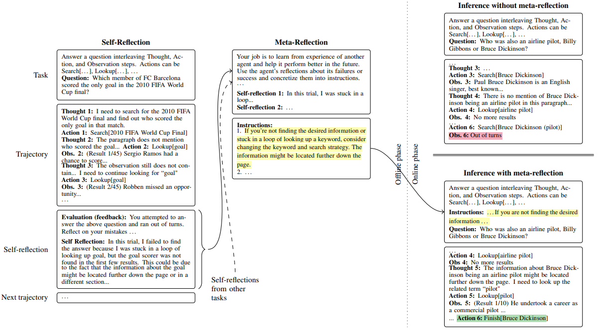

# METAREFLECTION: Learning Instructions for Language Agents using Past Reflections ([English](#english-version) | [Chinese](#中文版))
source: [paper](https://arxiv.org/abs/2405.13009) | [blog](https://www.microsoft.com/en-us/research/publication/metareflection-learning-instructions-for-language-agents-using-past-reflections/) | [github](https://github.com/microsoft/prose/tree/main/misc/MetaReflection)

> _In simple terms, this paper aims to help LLMs avoid repeating mistakes by learning from the **past errors** of React Agents. Specifically, whenever an LLM makes a mistake, it reflects on the cause of the error and collects these insights during the offline phase. Later, when deployed, these past errors are summarized and included in the prompt. This way, the LLM can leverage its prior mistakes while reasoning._

> _簡單來說，這篇論文希望透過學習React Agent**曾經犯過的錯誤**，幫助LLM避免重蹈覆轍。具體而言，LLM每次發生錯誤時，會進行反思分析錯誤的原因，並在**離線階段**收集這些原因。未來上線時，將這些錯誤經驗整理並加入到prompt中。如此一來，LLM在進行推理時，就能借鑑之前的錯誤經驗。_

# English Version

## Problem
The paper addresses the challenge of improving the performance of large language model (LLM)-based agents, which often rely on black-box, closed-API models like GPT-4. Current methods such as self-reflection and prompt optimization face limitations: self-reflection can only be applied online, and prompt optimization methods struggle with complex, multi-step tasks. These limitations hinder the fine-tuning and improvement of language agents, especially in settings requiring logical reasoning, domain-specific reasoning, and multi-step workflows.

## Solution
The paper introduces METAREFLECTION, an offline reinforcement learning technique that enhances LLM-based agents by developing semantic memory. This memory is built iteratively through simulations of past failures, where the agent generalizes self-reflections into meta-reflections—a set of actionable rules that augment future trajectories. Unlike prior approaches, METAREFLECTION works in both single-step and multi-step agent settings. The process involves:

1. Self-reflection: Agents reflect on failed trials to identify mistakes.
2. Meta-reflection: Self-reflections are generalized into task-agnostic instructions that form semantic memory.
3. Offline learning: Agents use semantic memory in future interactions to improve their performance.
The method's novelty lies in its ability to convert experiential learning into reusable knowledge, enabling offline reinforcement and reducing dependence on repeated LLM calls.

## Result
- Performance Gains: METAREFLECTION outperforms raw GPT-4 baselines by 4% to 16.82% across tasks, including:

  - Complex logical reasoning (e.g., BIGBENCH datasets like causal judgment, epistemic reasoning).
  - Biomedical semantic similarity (BIOSSES).
  - Open-domain QA (HOTPOTQA with distractor and ground-truth settings).
  - A new dataset for vulnerability threat detection in Infrastructure-as-Code (IAC).
  - Efficiency: It requires significantly fewer LLM calls (up to 17x fewer compared to some baselines like PROTEGI) to achieve or exceed state-of-the-art prompt optimization results.

- Qualitative Results: Learned instructions from METAREFLECTION capture nuanced domain-specific patterns (e.g., identifying Azure security group associations in IAC tasks) that other baselines fail to address.

- Multi-Step Agents: METAREFLECTION nearly doubles the performance of multi-step agents like REACT (reasoning and acting in multi-step QA tasks).

## Observation
- Novel Dataset: The introduction of a new dataset for detecting vulnerabilities in Terraform modules highlights METAREFLECTION's ability to handle domain-specific reasoning in resource-constrained contexts.

- Diversity of Learned Rules: Example instructions include adapting search keywords when stuck in loops (HOTPOTQA) or identifying indirect resource associations in IAC vulnerability detection. These generalized rules enhance robustness and adaptability across tasks.

- Iterative Refinement: Unlike existing prompt optimization techniques, METAREFLECTION refines memory iteratively using verbal feedback, creating task-specific but widely applicable instructions.

## Conclusion
METAREFLECTION is a significant step forward in improving LLM-based language agents through offline experiential learning. It generalizes agent-specific failures into actionable knowledge, leading to better performance across diverse tasks with reduced computational cost. The approach is particularly effective for complex or multi-step tasks where current methods like prompt optimization fail.

### Strengths
1. Innovation: Introduces offline reinforcement learning with semantic memory, filling a critical gap in the field.
2. Versatility: Applicable across diverse domains (QA, semantic similarity, vulnerability detection) and agent types (single-step, multi-step).
3. Efficiency: Substantially reduces the computational cost compared to state-of-the-art baselines.
### Weaknesses
1. Validation Stochasticity: The reliance on small validation sets during meta-reflection introduces potential instabilities in learning.
2. Task-Specific Adjustments: Performance improvements depend on the quality of task-specific feedback and might be harder to generalize to entirely new domains.
### Future Directions
1. Multi-Agent Memory Sharing: Exploring how semantic memory can be shared across agents to enhance collaboration.
2. Stability Improvements: Refining reward signals and validation mechanisms to reduce learning instabilities.
3. Scaling to More Domains: Applying METAREFLECTION to other tasks like program synthesis or interactive decision-making.

# 中文版

## 問題
這篇論文針對如何提升大型語言模型（LLM）驅動的語言代理（Language Agents）的性能提出解決方案，尤其是在這些代理依賴封閉式 API 模型（如 GPT-4）的情境下。現有方法如 **自我反思（self-reflection）** 和 **提示優化（prompt optimization）** 存在如下局限性：

1. **自我反思**：僅能用於在線（online）學習，且需要多次反覆的任務交互。
2. **提示優化**：主要適用於簡單的單步任務，對於需要邏輯推理或多步操作的複雜任務效果有限。

這些問題阻礙了語言代理在多領域和多步驟工作流程中的進一步改進。

---

## 解決方案
本文提出了 **METAREFLECTION**，一種基於離線增強學習（Offline Reinforcement Learning）的新技術，通過構建 **語義記憶（Semantic Memory）** 來提升語言代理的性能。該方法主要特徵如下：

1. **自我反思**：讓代理在失敗的試驗後，生成對失誤的分析。
2. **後設反思（Meta-Reflection）**：將自我反思一般化，提煉為可重複使用的指導規則，形成語義記憶。
3. **離線學習**：透過模擬失敗案例，將語義記憶應用於未來任務，幫助代理改進其行為軌跡。

相比現有方法，METAREFLECTION 的主要創新點在於將過去的學習經驗轉化為適用於新情境的通用知識，減少對多次 LLM 調用的依賴，並可適用於單步與多步代理。

---

## 實驗結果
### 性能提升：
1. **準確率提升**：
   - METAREFLECTION 在多個任務中的準確率相較 GPT-4 基線提升 **4% 至 16.82%**，包括：
     - 複雜邏輯推理（如 BIGBENCH 子集：因果判斷、知識推理等）。
     - 生物醫學語義相似性（BIOSSES）。
     - 開放域問答（HOTPOTQA，包括 Distractor 和 Ground Truth 兩種設定）。
     - 基於基礎設施代碼（IAC）的漏洞檢測新數據集。
2. **高效性**：
   - METAREFLECTION 所需的 LLM 調用次數顯著低於基準方法（如 PROTEGI，多達 **17 倍**），但在性能上達到甚至超越最先進的提示優化技術。
3. **質性評估**：
   - 在 IAC 漏洞檢測中，METAREFLECTION 所學習的規則能捕捉到其他方法無法處理的領域特定細節（例如 Terraform 資源鎖定的具體實現）。
4. **多步代理**：
   - 在多步代理（如 REACT）中，METAREFLECTION 的表現相較於 GPT-4 基線幾乎提升一倍。

---

## 觀察
1. **新數據集貢獻**：
   - 作者引入了基於 IAC 的漏洞檢測數據集，展示了 METAREFLECTION 處理領域特定推理任務的能力。
2. **多樣化規則學習**：
   - 學到的規則包括調整關鍵詞以避免搜尋重複（HOTPOTQA）、識別 IAC 資源間的間接關聯等，這些通用化的知識能提高代理的靈活性。
3. **迭代式改進**：
   - 不同於傳統的提示優化技術，METAREFLECTION 通過自我反思來逐步優化語義記憶，實現針對性改進。

---

## 結論
METAREFLECTION 是一種創新的增強學習技術，通過語義記憶的建立，顯著提升了語言代理的性能。它將過去的失敗經驗轉化為通用的行動規則，尤其適用於複雜和多步驟的任務，同時降低了計算成本。

### 優點
1. **創新性**：首次引入基於離線語義記憶的增強學習框架。
2. **多功能性**：適用於多領域（問答、語義分析、漏洞檢測）和多種類型代理（單步、連續多步）。
3. **高效率**：以更少的資源實現與或超越最先進方法的性能。

### 缺點
1. **驗證不穩定性**：小樣本驗證集可能導致學習的不穩定。
2. **依賴特定領域反饋**：性能提升高度依賴於任務特定的反饋訊息，可能難以泛化到完全陌生的領域。

### 未來方向
1. **多代理記憶共享**：探索語義記憶在多代理間的共享，以提升合作能力。
2. **改進穩定性**：優化獎勵信號和驗證機制，減少學習過程中的波動。
3. **拓展應用場景**：將 METAREFLECTION 應用於程式合成、交互式決策等新領域。
